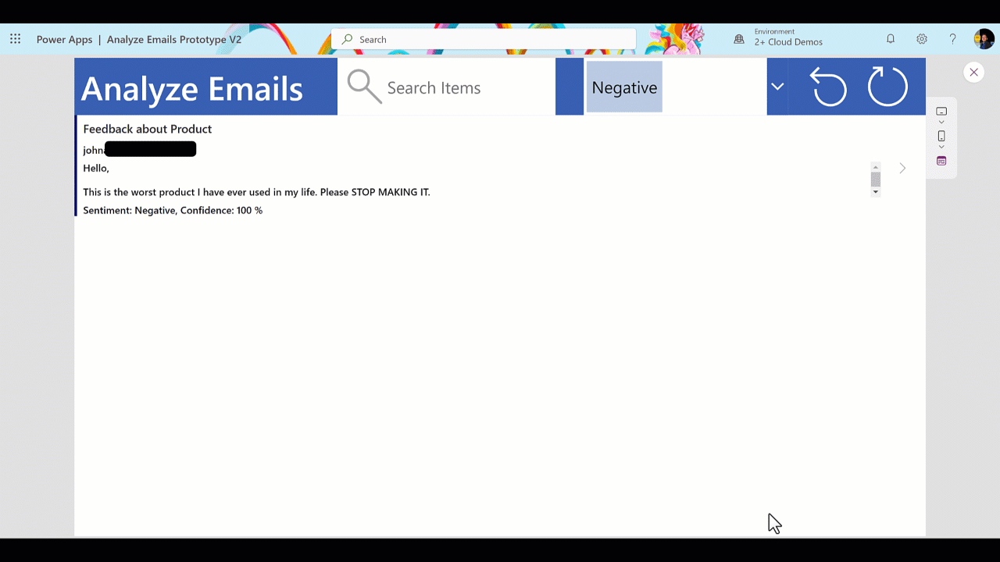

# Automate Business Email Management - AI Builder + PowerApps
Step-by-step guide on creating a Three-Screen Power App from scratch, connecting it to Outlook email service, and AI Builder Sentiment Analysis prebuilt model to detect positive, negative, or neutral sentiment in our emails and help us respond to critical emails effectively using low code tools.

[Link Here]()

  ## First Screen
  

  ## Second Screen
  

  ## Third Screen
  

  ## Example
  

